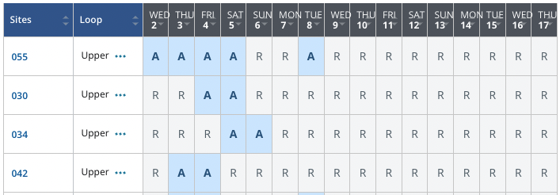

### Campsite Alert

Welcome to Campsite Alert! This script updates you on the availability of your favorite campsite at your favorite park on [recreation.gov](https://recreation.gov/) on a given schedule.

### Using Campsite Alert

The required parameters for the script are:

- `--start_date`  
- `--end_date`  
- `--park_id`  

#### Example Usage  

The following command checks for campsite availability:

- Between `2025-06-25` and `2025-07-05`
- At the parks `233235` and `232269`
- Looking for campsites that are available for **at least 3 consecutive days**
- Refreshing every `0.1` minutes for a total duration of `1` minute
- Displays output in **table format**  

```bash
python Campsite_Alert.py \
    --start_date 2025-06-25 \
    --end_date 2025-07-05 \
    --park_id 233235 232269 \
    --num_days 3 \
    --cycle_time 0.1 \
    --total_time 1 \
    --output_format table
```

#### Example Output (Table Format)

```bash
🏞️  233235 : REVERSED CREEK CAMPGROUND
🌐  Table View
┏━━━━━━━━━━━━━━━━━━━━━━━━━━━━━━━━━━━━┳━━━━━━━┳━━━━━━━┓
┃ Date Range                         ┃ 015   ┃ 016   ┃
┣━━━━━━━━━━━━━━━━━━━━━━━━━━━━━━━━━━━━╋━━━━━━━╋━━━━━━━┫
┃ 2025-06-25 --> 2025-06-27         ┃ A     ┃ A     ┃
┃ 2025-06-26 --> 2025-06-28         ┃ A     ┃ A     ┃
┃ 2025-06-27 --> 2025-06-29         ┃ A     ┃ A     ┃
┗━━━━━━━━━━━━━━━━━━━━━━━━━━━━━━━━━━━━┻━━━━━━━┻━━━━━━━┛
```

#### Example Output (Summary Format)

```bash
🗓️ On 2025-06-25 --> 2025-06-28: 2 out of 2 campsites are available.
🗓️ On 2025-06-26 --> 2025-06-29: 2 out of 2 campsites are available.
🗓️ On 2025-06-27 --> 2025-06-30: 2 out of 2 campsites are available.
```

### Parameters and Arguments

#### Required Arguments

- `--start_date` : Specify the start date for availability search (format: YYYY-MM-DD)
- `--end_date` : Specify the end date for availability search (format: YYYY-MM-DD)
- `--park_id` : Park ID(s) (multiple IDs can be specified)

#### Optional Arguments

- `--campsite` : Specify campsite IDs (can be multiple)
- `--num_days` : Number of **consecutive** days required (default: 1)
- `--cycle_time` : Interval between refreshes in **minutes** (default: 1)
- `--total_time` : Total runtime before the script stops, in **minutes** (default: 1)
- `--output_format` : Choose between `summary` or `table` (default: `table`)

### Finding Park and Campsite IDs

#### `--park_id`

To find the necessary IDs for the park you're interested in, navigate to [recreation.gov](https://recreation.gov/) and find your park of interest.

For example, the [Upper Pines](https://www.recreation.gov/camping/campgrounds/232447) page URL is:  

`https://www.recreation.gov/camping/campgrounds/232447`  

The `park_id` is the numeric value at the end of the URL: `232447`.

#### `--campsite`

The campsite is simply the designated `Sites` referred to on the chart.



### Notes

- This script runs continuously based on `cycle_time` until `total_time` is reached.
- If multiple `park_id` values are provided, the script checks each park individually.
- If `num_days` is specified, the script filters only those campsites available for **at least** the given number of consecutive days.
- The script can display results in either **table** or **summary** format based on the `--output_format` argument.


